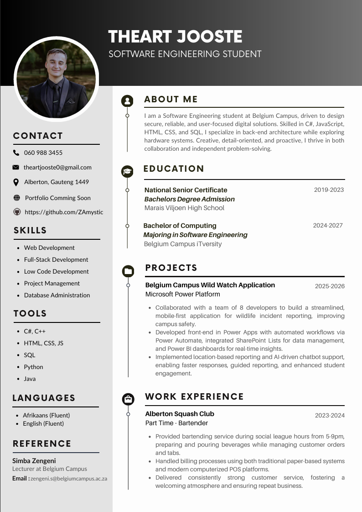

<h1 align="center">Hello I'm Theart Jooste</h1>

###

  

###

<h3 align="center">Software Engineer | Bachelor of Computing Student at Belgium Campus</h3>

###

<h5 align="center">📍 Pretoria, Gauteng, South Africa 🎓 Belgium Campus (2024 - 2027)</h5>

###

I’m a Software Engineering student at Belgium Campus with a keen focus on building reliable, intuitive, and high-performing digital solutions. My passion for technology stems from a deep curiosity about how systems work behind the scenes—whether it’s designing clean software architecture or assembling custom hardware. I take pride in creating tools that are not only functional but also deliver refined user experiences.  Tech Stack & Development Focus I’m proficient in C#, JavaScript, HTML, CSS, and SQL, with a growing interest in full-stack development. While I enjoy building end-to-end solutions, my core strength lies in back-end architecture—ensuring that what powers the product is just as solid as what users see.

###

<h1 align="center"></h1>

###

## 📜 Certifications

 
 

###

<h1 align="left"></h1>

### 

<h3 align="center">My CV</h3>

  

<h1 align="center"></h1>

###

<h3 align="center">Skills</h3>

###

🖥️ Front-End Development

###

  
  
  

###

🧠 Back-End Development

###

  
  
  
  
  
  
  

###

🔧 Hardware & Embedded Systems

###

  

###

<h1 align="left"></h1>

###

<h3 align="center">Projects</h3>

###

Website email signature creator for a courier company - (https://github.com/ZAmystic/EmailSignatureApplication)

Fitness tracker WebApp - (https://github.com/ZAmystic/WPR281-Fitness-Website)

API weather C# app - (https://github.com/ZAmystic/Weather-Application)

<h1 align="left"></h1>

<h3 align="left">My Github Statistics</h3>

###

  

###
