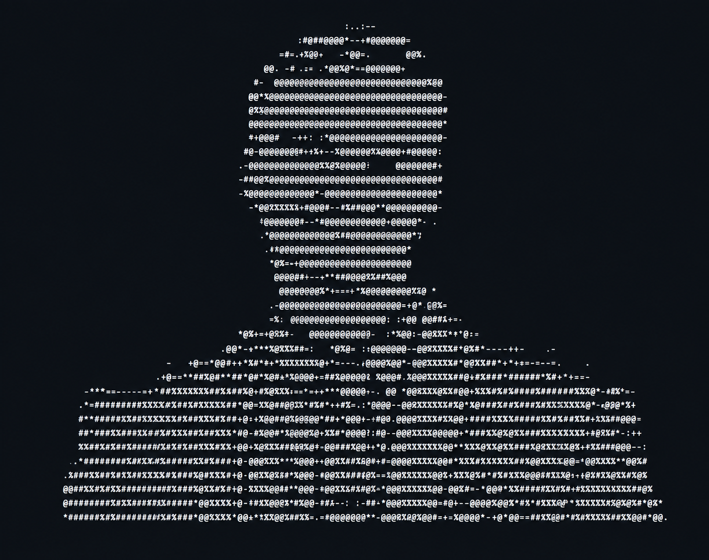
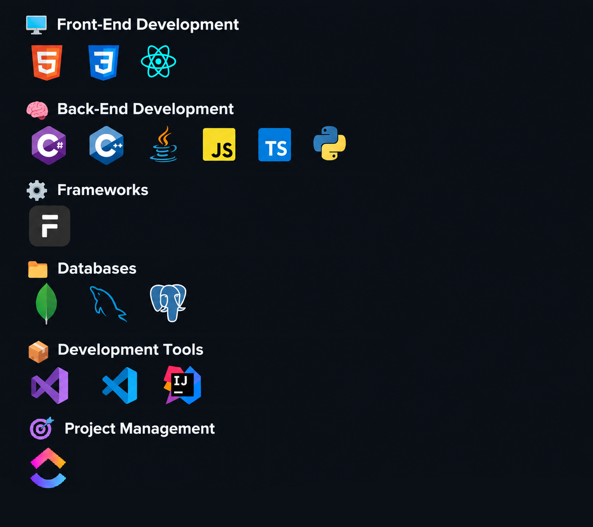

<h1>Hello I'm Theart Jooste</h1>

###

  

  

###

<h3 align="center">Software Engineer</h3>

###

<h5 align="center">📍 Pretoria, Gauteng, South Africa 🎓 Belgium Campus (2024 - 2027) Bachelor of Computing</h5>

###

I’m a Software Engineering student at Belgium Campus with a keen focus on building reliable, intuitive, and high-performing digital solutions. My passion for technology stems from a deep curiosity about how systems work behind the scenes—whether it’s designing clean software architecture or assembling custom hardware. I take pride in creating tools that are not only functional but also deliver refined user experiences.  Tech Stack & Development Focus I’m proficient in C#, JavaScript, HTML, CSS, and SQL, with a growing interest in full-stack development. While I enjoy building end-to-end solutions, my core strength lies in back-end architecture—ensuring that what powers the product is just as solid as what users see.

###

<h1 align="left"></h1>

###

<h3 align="center">Skills</h3>

###

  

###

<h1 align="left"></h1>

###

<h3 align="left">My Github Statistics</h3>

###

  

###
